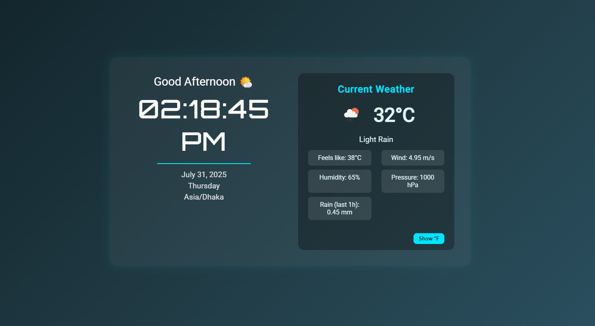

# ⏰🌤️ TimeGlide UI

**TimeGlide** is a sleek and responsive web-based application that combines a real-time digital clock with live weather data. Designed with a modern aesthetic and minimalistic approach, it displays current time and location-based weather information with intuitive visual elements.

 <!-- Replace with actual screenshot -->

---

## 🚀 Live Demo

[🔗 View Live](https://irfantech-x.github.io/TimeGlide-ui/) <!-- Optional if deployed -->

---

## ✨ Features

- ⏱️ Real-time 12-hour digital clock with AM/PM
- 📅 Displays current weekday, date, and time
- 📍 Auto-detects location using the browser's Geolocation API
- 🌡️ Weather data fetched from OpenWeatherMap API
  - Temperature (°C / °F)
  - Weather condition (e.g., Cloudy, Clear, Rain)
  - Humidity and wind speed
- 📱 Fully responsive and clean UI using CSS Grid & Flexbox
- 🌓 Dark-themed elegant layout

---

## 🛠️ Technologies Used

- HTML5
- CSS3 (Responsive Design with Grid & Flexbox)
- JavaScript (ES6+)
- OpenWeatherMap API
- Google Fonts

---

## 📁 Project Structure

```
TimeGlide-ui/
├── index.html       # Main HTML structure
├── style.css        # All styling for layout and components
├── script.js        # Logic for clock and weather functionality
└── README.md        # Project documentation
```

---

## 🔧 Getting Started

### 1. Clone the Repository

```bash
git clone https://github.com/IrfanTech-X/TimeGlide-ui.git
cd TimeGlide-ui
```

### 2. Open the App

Just open the `index.html` file in your browser.

---

## 🌐 Deployment

You can deploy the project using GitHub Pages:

1. Push your code to GitHub
2. Go to the repository's **Settings > Pages**
3. Choose the `main` branch and `/root` as the source
4. Save and access your site via the provided GitHub Pages URL

---


---

## 💡 Learning Objectives

- Build dynamic and interactive UIs using vanilla JavaScript
- Use the Geolocation and OpenWeatherMap APIs
- Manipulate DOM elements in real time
- Apply responsive design principles using CSS Grid and Flexbox

---

## 📜 License

This project is licensed under the [MIT License](LICENSE).  
You are free to use, modify, and distribute this project for personal or educational purposes.

---

## 🙋‍♂️ Author

**Irfan Ferdous Siam**  
🎓 BSc in CSE, Green University of Bangladesh  
📧 Email: [siamtalukdar3@gmail.com](mailto:siamtalukdar3@gmail.com)  
🔗 LinkedIn: [linkedin.com/in/irfan-ferdous-siam](https://linkedin.com/in/irfan-ferdous-siam)  
💻 GitHub: [github.com/IrfanTech-X](https://github.com/IrfanTech-X)

